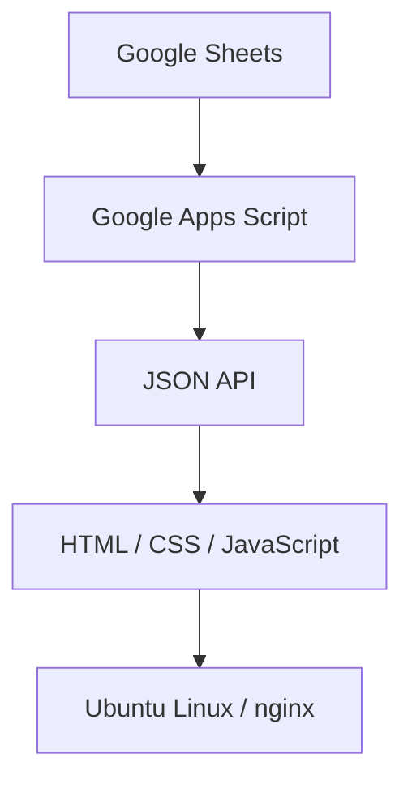

# Release Note Hub

Release Note Hubは、Google Sheetsで管理したリリース情報を
GAS経由で取得し、Webページとして公開する個人学習用プロジェクトです。

このプロジェクトでは、
- 技術情報の構造化
- GitHubによる変更管理
- SphinxによるDocs-as-Code
- Ubuntu Linux / nginxによるWeb公開

までを一連で実践しています。

> [!NOTE]
> 本リポジトリは個人学習の成果物です。実務で使用しているコードやデータは含みません。

## このプロジェクトで実践したこと

- GitHub Issueを起点としたbranch、commit、Pull Request、merge
- Google SheetsとGASを使った公開データの管理
- HTML／CSS／JavaScriptによるリリースノート画面の作成
- Sphinx／reStructuredTextによる技術ドキュメントの作成とHTMLビルド
- Ubuntu Linuxとnginxを使った静的コンテンツの公開

## アーキテクチャ


ソースコードと変更履歴はGitHubで管理し、利用手順と構成説明はSphinxで文書化しています。

## リポジトリ構成

```text
.
├── index.html          # リリースノート表示画面
├── gas/
│   └── Code.gs         # 公開データをJSONで返すGAS
├── docs/
│   ├── conf.py         # Sphinx設定
│   ├── index.rst       # ドキュメント原稿
│   └── requirements.txt
└── README.md
```

Sphinxの生成物はリポジトリに含めず、原稿と公開物を分けて管理します。

## データ形式

Google Sheetsには次の列を用意します。

| 列 | 内容 | 例 |
| --- | --- | --- |
| A | Release Date | `2026-08-17` |
| B | Title | `検索機能を改善しました` |
| C | Category | `Improvement` |
| D | Summary | `一覧から検索可能になりました` |
| E | Detail | `キーワード検索に対応しました` |
| F | Status | `Published` |

`Status` が `Published` の行だけを公開対象とします。

## 動作確認

1. `index.html` をブラウザで開きます。
2. 画面がGASのWebアプリからJSONを取得します。
3. 公開対象のリリース情報が新しい順に表示されます。

ローカル環境でブラウザの制約により取得できない場合は、任意の簡易HTTPサーバーまたはnginxから配信してください。

## Sphinxドキュメントのビルド

Python環境で次を実行します。

```bash
python -m pip install -r docs/requirements.txt
sphinx-build -b html docs docs/_build/html
```

生成された `docs/_build/html/index.html` をブラウザで確認します。

## 公開時の確認事項

- GASのWebアプリを、意図したアクセス範囲で公開していること
- シートに個人情報・機密情報を含めないこと
- `Status` が `Published` の行だけが返ること
- WebページからGASのURLへアクセスできること
- nginxが起動し、最新のHTMLを配信していること

## 今後の改善案

- GitHub ActionsによるSphinxドキュメントの自動ビルド
- リンク切れやビルドエラーの自動チェック
- カテゴリやキーワードによる絞り込み
- 読み込み中・データなし・通信失敗時の表示改善
